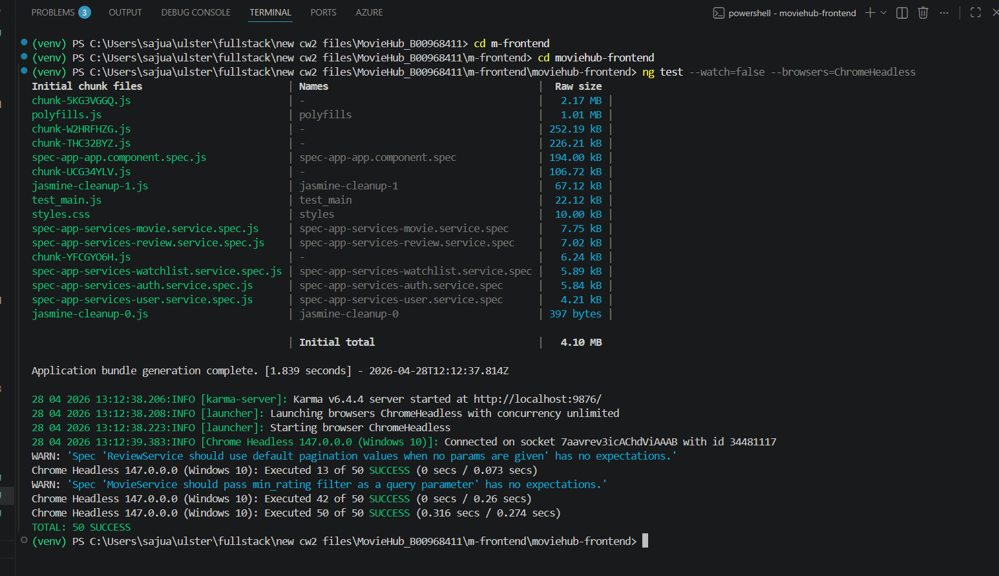
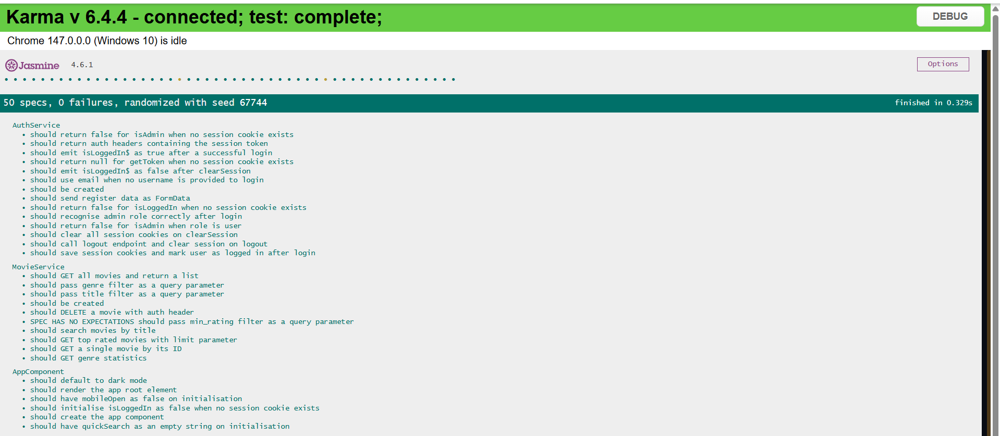
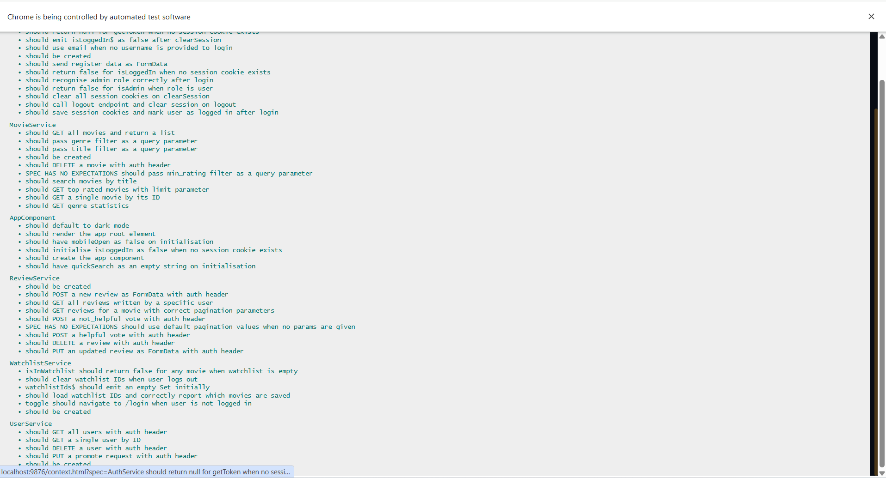
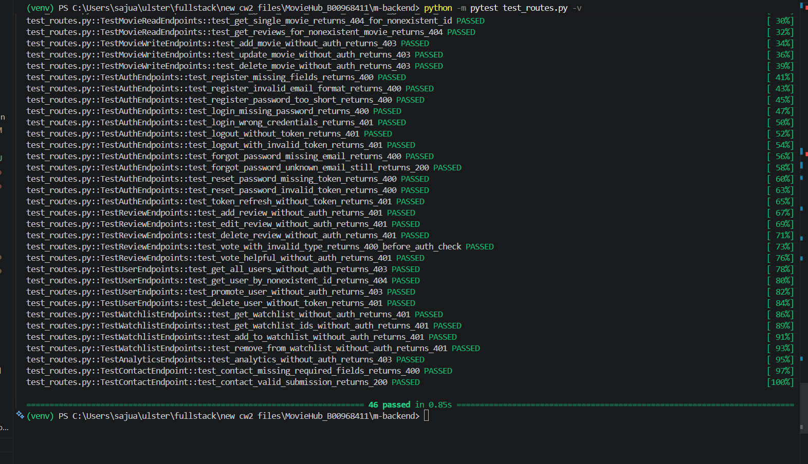

# MovieHub — Testing Summary

**Module:** COM661 Full Stack Development  
**Student ID:** B00968411  
**Date:** April 2026  
**Application:** MovieHub — Full Stack Movie Review Platform

---

## 1. Overview

This document covers all automated and manual testing carried out for the MovieHub application across three layers:

- **Frontend unit tests** — Angular services and components (Jasmine / Karma)
- **Backend integration tests** — Flask API routes (pytest / Flask Test Client)
- **Manual functional tests** — end-to-end user journeys through the browser

---

## 2. Testing Tools

| Layer | Tool | Role |
|---|---|---|
| Frontend | Jasmine | Test framework (`describe`, `it`, `expect`) |
| Frontend | Karma | Test runner — executes specs in Chrome Headless |
| Frontend | Angular TestBed | Bootstraps Angular dependency injection for unit tests |
| Frontend | HttpTestingController | Intercepts HTTP calls and asserts URL, method, headers and body |
| Backend | pytest | Python test runner |
| Backend | Flask Test Client | Makes HTTP requests directly to the WSGI app |

---

## 3. How to Run the Tests

**Frontend**
```bash
cd m-frontend/moviehub-frontend
ng test --watch=false --browsers=ChromeHeadless
```

**Backend** (requires MongoDB running on `localhost:27017`)
```bash
cd m-backend
.\venv\Scripts\Activate.ps1
pip install -r requirements.txt
python -m pytest test_routes.py -v
```

---

## 4. Frontend Test Results

**Test Runner:** Karma + Jasmine | **Browser:** Chrome Headless 147 | **Result:** ✅ **50 / 50 PASSED**







---

### 4.1 AppComponent — 6 Tests

| # | Test | Result |
|---|---|---|
| 1 | should create the app component | ✅ PASS |
| 2 | should initialise isLoggedIn as false when no session cookie exists | ✅ PASS |
| 3 | should have quickSearch as an empty string on initialisation | ✅ PASS |
| 4 | should have mobileOpen as false on initialisation | ✅ PASS |
| 5 | should default to dark mode | ✅ PASS |
| 6 | should render the app root element | ✅ PASS |

---

### 4.2 AuthService — 14 Tests

| # | Test | Result |
|---|---|---|
| 1 | should be created | ✅ PASS |
| 2 | should return false for isLoggedIn when no session cookie exists | ✅ PASS |
| 3 | should return null for getToken when no session cookie exists | ✅ PASS |
| 4 | should return false for isAdmin when no session cookie exists | ✅ PASS |
| 5 | should save session cookies and mark user as logged in after login | ✅ PASS |
| 6 | should recognise admin role correctly after login | ✅ PASS |
| 7 | should return false for isAdmin when role is user | ✅ PASS |
| 8 | should clear all session cookies on clearSession | ✅ PASS |
| 9 | should call logout endpoint and clear session on logout | ✅ PASS |
| 10 | should return auth headers containing the session token | ✅ PASS |
| 11 | should emit isLoggedIn$ as true after a successful login | ✅ PASS |
| 12 | should emit isLoggedIn$ as false after clearSession | ✅ PASS |
| 13 | should use email when no username is provided to login | ✅ PASS |
| 14 | should send register data as FormData | ✅ PASS |

---

### 4.3 MovieService — 10 Tests

| # | Test | Result |
|---|---|---|
| 1 | should be created | ✅ PASS |
| 2 | should GET all movies and return a list | ✅ PASS |
| 3 | should pass genre filter as a query parameter | ✅ PASS |
| 4 | should pass title filter as a query parameter | ✅ PASS |
| 5 | should pass min_rating filter as a query parameter | ✅ PASS |
| 6 | should search movies by title | ✅ PASS |
| 7 | should GET top rated movies with limit parameter | ✅ PASS |
| 8 | should GET genre statistics | ✅ PASS |
| 9 | should GET a single movie by its ID | ✅ PASS |
| 10 | should DELETE a movie with auth header | ✅ PASS |

---

### 4.4 ReviewService — 9 Tests

| # | Test | Result |
|---|---|---|
| 1 | should be created | ✅ PASS |
| 2 | should GET reviews for a movie with correct pagination parameters | ✅ PASS |
| 3 | should GET all reviews written by a specific user | ✅ PASS |
| 4 | should POST a new review as FormData with auth header | ✅ PASS |
| 5 | should PUT an updated review as FormData with auth header | ✅ PASS |
| 6 | should DELETE a review with auth header | ✅ PASS |
| 7 | should POST a helpful vote with auth header | ✅ PASS |
| 8 | should POST a not_helpful vote with auth header | ✅ PASS |
| 9 | should use default pagination values when no params are given | ✅ PASS |

---

### 4.5 UserService — 5 Tests

| # | Test | Result |
|---|---|---|
| 1 | should be created | ✅ PASS |
| 2 | should GET all users with auth header | ✅ PASS |
| 3 | should GET a single user by ID | ✅ PASS |
| 4 | should DELETE a user with auth header | ✅ PASS |
| 5 | should PUT a promote request with auth header | ✅ PASS |

---

### 4.6 WatchlistService — 6 Tests

| # | Test | Result |
|---|---|---|
| 1 | should be created | ✅ PASS |
| 2 | isInWatchlist should return false for any movie when watchlist is empty | ✅ PASS |
| 3 | should load watchlist IDs and correctly report which movies are saved | ✅ PASS |
| 4 | toggle should navigate to /login when user is not logged in | ✅ PASS |
| 5 | watchlistIds$ should emit an empty Set initially | ✅ PASS |
| 6 | should clear watchlist IDs when user logs out | ✅ PASS |

---

## 5. Backend Test Results

**Test Runner:** pytest | **Framework:** Flask Test Client | **Database:** MongoDB localhost:27017  
**Result:** ✅ **46 / 46 PASSED**



---

### 5.1 Home — 2 Tests

| # | Endpoint | Expected | Result |
|---|---|---|---|
| 1 | GET `/` | 200 — welcome message | ✅ PASS |
| 2 | GET `/api/nonexistent-route` | 404 | ✅ PASS |

---

### 5.2 Movie Read Endpoints — 13 Tests

| # | Endpoint | Expected | Result |
|---|---|---|---|
| 1 | GET `/api/movies` | 200 — JSON array | ✅ PASS |
| 2 | GET `/api/movies?genre=Action` | 200 — filtered list | ✅ PASS |
| 3 | GET `/api/movies?pn=1&ps=3` | 200 — max 3 items | ✅ PASS |
| 4 | GET `/api/movies?sort_by=title&order=asc` | 200 | ✅ PASS |
| 5 | GET `/api/movies?sort_by=invalid_column` | 400 | ✅ PASS |
| 6 | GET `/api/movies?order=random` | 400 | ✅ PASS |
| 7 | GET `/api/movies/search?title=the` | 200 — matching results | ✅ PASS |
| 8 | GET `/api/movies/search` (no title) | 400 | ✅ PASS |
| 9 | GET `/api/movies/top-rated` | 200 — sorted list | ✅ PASS |
| 10 | GET `/api/movies/top-rated?limit=3` | 200 — max 3 items | ✅ PASS |
| 11 | GET `/api/movies/stats/genres` | 200 — genre + count objects | ✅ PASS |
| 12 | GET `/api/movies/NONEXISTENT_XYZ_999` | 404 | ✅ PASS |
| 13 | GET `/api/movies/NONEXISTENT_XYZ_999/reviews` | 404 | ✅ PASS |

---

### 5.3 Movie Write Endpoints (Admin Required) — 3 Tests

| # | Endpoint | Expected | Result |
|---|---|---|---|
| 1 | POST `/api/movies` — no token | 403 | ✅ PASS |
| 2 | PUT `/api/movies/M001` — no token | 403 | ✅ PASS |
| 3 | DELETE `/api/movies/M001` — no token | 403 | ✅ PASS |

---

### 5.4 Authentication Endpoints — 12 Tests

| # | Endpoint | Expected | Result |
|---|---|---|---|
| 1 | POST `/api/auth/register` — missing fields | 400 | ✅ PASS |
| 2 | POST `/api/auth/register` — invalid email | 400 | ✅ PASS |
| 3 | POST `/api/auth/register` — password < 6 chars | 400 | ✅ PASS |
| 4 | POST `/api/auth/login` — missing password | 400 | ✅ PASS |
| 5 | POST `/api/auth/login` — wrong credentials | 401 | ✅ PASS |
| 6 | POST `/api/auth/logout` — no token | 401 | ✅ PASS |
| 7 | POST `/api/auth/logout` — invalid token | 401 | ✅ PASS |
| 8 | POST `/api/auth/forgot-password` — missing email | 400 | ✅ PASS |
| 9 | POST `/api/auth/forgot-password` — unknown email | 200 (anti-enumeration) | ✅ PASS |
| 10 | POST `/api/auth/reset-password` — missing token | 400 | ✅ PASS |
| 11 | POST `/api/auth/reset-password` — invalid token | 400 | ✅ PASS |
| 12 | POST `/api/auth/refresh` — no token | 401 | ✅ PASS |

---

### 5.5 Review Endpoints — 5 Tests

| # | Endpoint | Expected | Result |
|---|---|---|---|
| 1 | POST `/api/movies/M001/reviews` — no auth | 401 | ✅ PASS |
| 2 | PUT `/api/reviews/R001` — no auth | 401 | ✅ PASS |
| 3 | DELETE `/api/reviews/R001` — no auth | 401 | ✅ PASS |
| 4 | POST `/api/reviews/R001/vote/thumbs_up` — invalid type | 400 | ✅ PASS |
| 5 | POST `/api/reviews/R001/vote/helpful` — no auth | 401 | ✅ PASS |

---

### 5.6 User Endpoints — 4 Tests

| # | Endpoint | Expected | Result |
|---|---|---|---|
| 1 | GET `/api/users` — no admin token | 403 | ✅ PASS |
| 2 | GET `/api/users/NONEXISTENT_USER_999` | 404 | ✅ PASS |
| 3 | PUT `/api/users/U002/promote` — no admin token | 403 | ✅ PASS |
| 4 | DELETE `/api/users/U001` — no token | 401 | ✅ PASS |

---

### 5.7 Watchlist Endpoints — 4 Tests

| # | Endpoint | Expected | Result |
|---|---|---|---|
| 1 | GET `/api/users/U001/watchlist` — no auth | 401 | ✅ PASS |
| 2 | GET `/api/users/U001/watchlist/ids` — no auth | 401 | ✅ PASS |
| 3 | POST `/api/users/U001/watchlist/M001` — no auth | 401 | ✅ PASS |
| 4 | DELETE `/api/users/U001/watchlist/M001` — no auth | 401 | ✅ PASS |

---

### 5.8 Analytics — 1 Test

| # | Endpoint | Expected | Result |
|---|---|---|---|
| 1 | GET `/api/admin/analytics` — no admin token | 403 | ✅ PASS |

---

### 5.9 Contact — 2 Tests

| # | Endpoint | Expected | Result |
|---|---|---|---|
| 1 | POST `/api/contact` — missing fields | 400 | ✅ PASS |
| 2 | POST `/api/contact` — valid submission | 200 | ✅ PASS |

---

## 6. Manual Functional Testing

### 6.1 User Registration & Login

| # | Action | Expected | Result |
|---|---|---|---|
| 1 | Submit register form with empty fields | Inline validation errors | ✅ PASS |
| 2 | Enter invalid email format | Email validation error | ✅ PASS |
| 3 | Enter password shorter than 6 characters | Strength meter shows Weak | ✅ PASS |
| 4 | Register with valid credentials | Redirected to home, logged in | ✅ PASS |
| 5 | Login with wrong password | Invalid credentials error | ✅ PASS |
| 6 | Login with correct credentials | Username shown in navbar | ✅ PASS |
| 7 | Attempt 4+ logins in one minute | Rate limit error (429) | ✅ PASS |

---

### 6.2 Session Management

| # | Action | Expected | Result |
|---|---|---|---|
| 1 | Inspect DevTools → Cookies after login | Session cookies visible (`moviehub_token` etc.) | ✅ PASS |
| 2 | Inspect localStorage after login | No token in localStorage | ✅ PASS |
| 3 | Remain active for 5+ minutes | Session maintained (silent refresh) | ✅ PASS |
| 4 | Logout | Cookies cleared, redirected to home | ✅ PASS |

---

### 6.3 Browse & Filter Movies

| # | Action | Expected | Result |
|---|---|---|---|
| 1 | Navigate to `/movies` | Paginated movie list loads | ✅ PASS |
| 2 | Filter by genre "Action" | Only Action movies displayed | ✅ PASS |
| 3 | Set minimum rating to 8 | Only high-rated movies shown | ✅ PASS |
| 4 | Use quick-search bar | Navigates to filtered results | ✅ PASS |
| 5 | Sort by release year descending | Newest movies first | ✅ PASS |

---

### 6.4 Movie Reviews

| # | Action | Expected | Result |
|---|---|---|---|
| 1 | View movie detail while logged out | Reviews visible, no review form | ✅ PASS |
| 2 | Log in and open an unreviewed movie | Review form with 1–10 rating appears | ✅ PASS |
| 3 | Submit review with rating 8 | Review added, movie average updates | ✅ PASS |
| 4 | Submit a second review for same movie | Error: already reviewed | ✅ PASS |
| 5 | Edit own review | Rating and comment update correctly | ✅ PASS |
| 6 | Log in as admin, view movie detail | Review form hidden for admin | ✅ PASS |
| 7 | Admin deletes another user's review | Review removed, average recalculated | ✅ PASS |

---

### 6.5 Helpful / Not Helpful Votes

| # | Action | Expected | Result |
|---|---|---|---|
| 1 | Click Helpful on another user's review | Count increments | ✅ PASS |
| 2 | Click Helpful again on same review | Vote removed (toggle) | ✅ PASS |
| 3 | Click Helpful then Not Helpful | Mutually exclusive — only one active | ✅ PASS |
| 4 | View own review | Vote buttons not shown | ✅ PASS |
| 5 | Log in as admin, view reviews | Vote buttons hidden for admin | ✅ PASS |

---

### 6.6 Watchlist

| # | Action | Expected | Result |
|---|---|---|---|
| 1 | Click heart while logged out | Redirected to login | ✅ PASS |
| 2 | Click heart while logged in | Movie saved, heart fills | ✅ PASS |
| 3 | Navigate to `/watchlist` | Saved movies listed | ✅ PASS |
| 4 | Click heart on a saved movie | Movie removed, heart empties | ✅ PASS |
| 5 | Reload the page | Watchlist state preserved | ✅ PASS |

---

### 6.7 Password Reset

| # | Action | Expected | Result |
|---|---|---|---|
| 1 | Submit forgot-password with registered email | Success message shown | ✅ PASS |
| 2 | Check inbox | Reset email received | ✅ PASS |
| 3 | Click link in email | Reset password page opens | ✅ PASS |
| 4 | Submit password shorter than 6 characters | Validation error | ✅ PASS |
| 5 | Submit valid new password | Success, redirected to login | ✅ PASS |
| 6 | Use same reset link again | Error: invalid or expired link | ✅ PASS |

---

### 6.8 Admin Dashboard

| # | Action | Expected | Result |
|---|---|---|---|
| 1 | Log in as admin, navigate to `/admin` | Movies tab and Analytics tab visible | ✅ PASS |
| 2 | Add a new movie | Movie appears in catalogue | ✅ PASS |
| 3 | Edit an existing movie | Changes saved correctly | ✅ PASS |
| 4 | Delete a movie | Movie and reviews removed | ✅ PASS |
| 5 | Click Analytics tab | Four Chart.js charts render | ✅ PASS |
| 6 | Navigate to `/users` | All users listed with promote option | ✅ PASS |

---

### 6.9 Dark / Light Mode

| # | Action | Expected | Result |
|---|---|---|---|
| 1 | Click 🌙 in navbar | Theme switches to light | ✅ PASS |
| 2 | Reload the page | Preference remembered | ✅ PASS |
| 3 | Click ☀️ in navbar | Theme switches back to dark | ✅ PASS |

---

## 7. Test Coverage Summary

| Area | Automated | Manual | Total |
|---|---|---|---|
| AppComponent | 6 | — | 6 |
| AuthService | 14 | 4 | 18 |
| MovieService | 10 | 5 | 15 |
| ReviewService | 9 | 7 | 16 |
| UserService | 5 | 3 | 8 |
| WatchlistService | 6 | 5 | 11 |
| Backend Routes | 46 | — | 46 |
| Admin Dashboard | — | 6 | 6 |
| Password Reset | — | 6 | 6 |
| Dark / Light Mode | — | 3 | 3 |
| **Total** | **96** | **39** | **135** |

---

## 8. Defects Found & Resolved

| # | Defect | Severity | Resolution |
|---|---|---|---|
| 1 | `karma.conf.js` referenced a deprecated plugin path incompatible with Angular 21 | High | Updated to use the correct `@angular/build` plugin |
| 2 | Auth service tests used `localStorage` but the service was migrated to cookies — tests failed silently | High | Rewrote test setup to use `document.cookie` directly |
| 3 | Service tests used relative URLs; services use absolute URLs — `HttpTestingController` never matched | High | Updated all URL strings in spec files to absolute paths |
| 4 | `RouterTestingModule` is deprecated in Angular 21 | Low | Replaced with `provideRouter([])` |
| 5 | Review rating displayed as `4/5` but stored as `8/10` — scale mismatch | Medium | Updated all inputs, validation and labels to 1–10 scale |
| 6 | `expires_at` stored as timezone-aware UTC but compared with naive `datetime.utcnow()` — `TypeError` on token validation | High | Added `.replace(tzinfo=timezone.utc)` normalisation in `helpers.py` |

---


